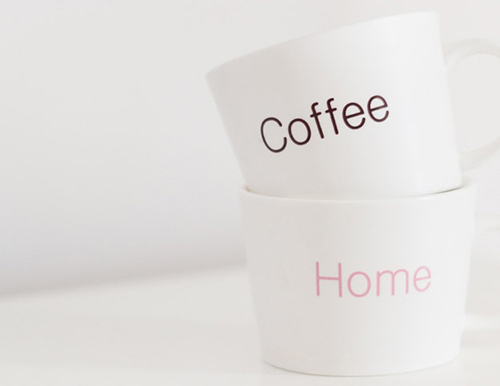

<div class="row">
  <div class="col-m-4">
    <div class="panel">
      <div class="panel-heading text-center">Panel</div>
      <div class="panel-body clear">
        
        <p>Fusce urna eget elit eu magna auctor odio. Morbi egestas.</p>
        <button type="button" class="btn pull-right">Button</button>
      </div>
    </div>
  </div>
  <div class="col-m-4">
    <div class="panel panel-primary">
      <div class="panel-heading text-center">Panel Primary</div>
      <div class="panel-body clear">
        
        <p>Fusce urna eget elit eu magna auctor odio. Morbi egestas.</p>
        <button type="button" class="btn btn-primary pull-right">Button</button>
      </div>
    </div>
  </div>
  <div class="col-m-4">
    <div class="panel panel-success">
      <div class="panel-heading text-center">Panel Success</div>
      <div class="panel-body clear">
        
        <p>Fusce urna eget elit eu magna auctor odio. Morbi egestas.</p>
        <button type="button" class="btn btn-success pull-right">Button</button>
      </div>
    </div>
  </div>
</div>
<div class="row">
  <div class="col-m-4">
    <div class="panel panel-warning">
      <div class="panel-heading text-center">Panel Warning</div>
      <div class="panel-body clear">
        
        <p>Fusce urna eget elit eu magna auctor odio. Morbi egestas.</p>
        <button type="button" class="btn btn-warning pull-right">Button</button>
      </div>
    </div>
  </div>
  <div class="col-m-4">
    <div class="panel panel-danger">
      <div class="panel-heading text-center">Panel Danger</div>
      <div class="panel-body clear">
        
        <p>Fusce urna eget elit eu magna auctor odio. Morbi egestas.</p>
        <button type="button" class="btn btn-danger pull-right">Button</button>
      </div>
    </div>
  </div>
  <div class="col-m-4">
    <div class="panel panel-info">
      <div class="panel-heading text-center">Panel Info</div>
      <div class="panel-body clear">
        
        <p>Fusce urna eget elit eu magna auctor odio. Morbi egestas.</p>
        <button type="button" class="btn btn-info pull-right">Button</button>
      </div>
    </div>
  </div>
</div>

```html
<div class="panel panel-primary">
  <div class="panel-heading text-center">Panel Header</div>
  <div class="panel-body clear">
    
    <p>Fusce urna eget elit eu magna auctor odio. Morbi egestas.</p>
    <button type="button" class="btn pull-right">Button</button>
  </div>
</div>
```

**Modificators:**

* `panel-primary`
* `panel-success`
* `panel-warning`
* `panel-danger`
* `panel-info`

Without modificator panel will stay plain gray.
